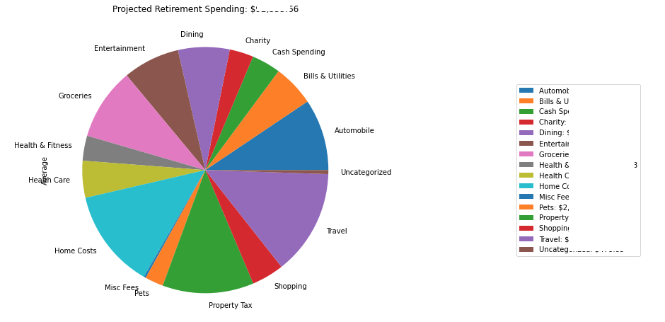
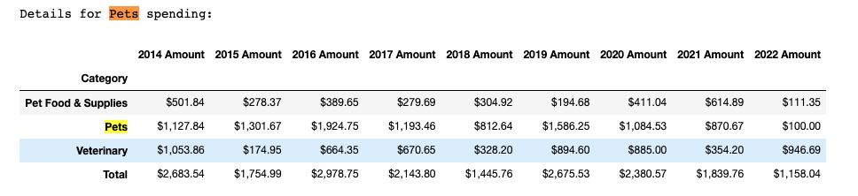

# analyze-mint-spending

This project provides a set of scripts and visualizations that allow Mint users to analyze their spending and income.

The first step is to transaform an export of raw Mint transaction data into a data set useful for spending or income analysis.

Once this raw data is broken down into a set of transactions that contributed to spending or income, the following analyses are performed:

- Visualize Annual Spending by Spending Group
  

- Predict Future Years Budget Needs by Averaging Expenses across past years
  
  
- Predict Spending Needs in Retirement

  
  
- Analyze year over year Spending Group by Category
    

Similar analyses are also made for income with these tools.

This project may be useful for Mint users who are comfortable exporting their transactions history to a .csv file. This project leverages both python `.py`, and `.ipython/juptyer` notebook files.   Users do not need to be familiar with python to run these scripts, but they should be comfortable working in a command line environment, editing csv files with a tool like MS Excel, and with installing the necessary programs as described in the checklist below.

## Checklist to build and start the application

Prerequisites:

1) The utilities in this package require conda python.  If this is not yet installed please, download and install it from here:  https://conda.io/miniconda.html

2) Using the git command line utility, clone [this projects repo](https://github.com/jpjpjp/analyze-mint-spending).  If you aren't familiar with cloning github repos you can download the project as a zip file by clicking on the green "Code" button above and selecting "Download ZIP".

3) Once properly cloned, or extracted, run the following command in the project directory:

    `conda env create -f environment.yml`

4) This will create the environment for the scripts to run in and download all necessary dependencies.   After this process completes run this command:

    `conda activate analyze-mint-spending`

This will "activate" the anaconda environment that will allow python to run. This final step must be repeated whenver the user starts a new command shell session in the project directory. (For those using an autoenv type utility, there is also a .env file for automatically activating the environment whenever the directory is entered.)

## Exporting Mint Transactions
Go to your Mint `Transactions`, it should look something like this:


Next, to export your transaction history, scroll to the bottom of the tab, and click the export link, which will prompt your browser to download a file. 


Save the export to file called `transactions.csv` in this project's directory.

## Preparing to extract just the Spending and Income transactions

Mint can capture both spending and income, but the total set of transactions that come from a mint export includes many things and may be categorized into more categories than allow for meaningful analysis.   Getting just the meaningful spending or income data can be a bit tricky.   Before the scripts can be run the user must set some configuration files that help separate the wheat from the chaff.

### Define Spending Groups

The Mint web interface groups categories into broader Spending Groups, for example categories such as "Tuition", "Student Loan", and "Books & Supplies" are all part of the "Education" Spending Group.   Unfortunately, Mint does not provide a way to maintain the Spending Group data as part of their export process.

These scripts can restore the Spending Group classification to the data set. To do this, a CSV (comma separated values) file, which describes which Categories belong to which Spending Group, is taken as input.  This project includes a [mint-spending-groups-template.csv](./mint-spending-groups-template.csv) file which matches the default Mint Spending Group definitions.

The format of the file is that the Spending Groups are defined in the first row, with the categories for each group included in that column, ex:
| Income          | Education             | Entertainment          |
|-----------------|-----------------------|------------------------|
| Paycheck        | Tuition               | Arts                   |
| Bonus           | Student Loan          | Music                  |
| Interest Income | Books & Supplies      | Movies & DVD           |
|                 |                       | Newspapers & Magazines |

Users should copy this file to a new filed called `mint-spending-groups.csv` which can be edited to include any custom created categories or to override the Mint default Spending Group logic.  Any transactions with Categories not defined in the Spending Group configuration file will be assigned a Spending Group with the same name as the Category.

### Exclude non-meaningful data

Mint data may include transactions that are not strictly spending or income.  For example, when credit cards are linked, payments to the credit card show as income (or a "Transaction Type" of "credit") from the credit card account but will also show up as a payment (or a "Transaction Type" of "debit") from your bank account.   We want to exclude all of this when analyzing income or spending.

Another problem area could be reimbursable business expenses.  These may show up in mint as both debits and credits and if we simply remove all credit transactions our spending numbers can be artificially high.   Some Mint users may also have transactions associated with a small business, such as an income property.   It may be helpful to remove these when doing a personal spending analysis. (Income Property owners may be interested in a companion project to [analyze Mint transactions associated with a property](https://github.com/jpjpjp/analyze-property))

These scripts can remove, and provide some level of analysis on, transactions that belong to Spending Groups that we want to exclude from our spending or income data sets.   For users who are interested in analyzing their spending, this project includes an [exclude-from-spending-groups-template.csv](./exclude-from-spending-groups-template.csv) file which suggests Spending Groups to remove from the spending transaction data.  The format of this file is as follows:

| Spending Group       | Hide Analysis         |
|----------------------|-----------------------|
| Credit Card Spending |                       |
| Transfer             |                       |
| Income               | True                  |

Users should copy this file to a new file called `exclude-from-spending-groups.csv` and update it based on their own data.   When the scripts are run, all transactions associated with the listed Spending Groups are removed from the data set.  Unless the "Hide Analysis" column is set to True, the script will print out some details about the credits and debits associated with all the transactions in the group.  For Spending Groups like Credit Card Spending, or Reimbursable Expenses it can be useful to see if these numbers roughly match, as this may indicate the need to re-categorize certain transactions in Mint.

The process is similar for creating a data set for an income analysis, although the scripts are smart enough to remove any Spending Group whose transactions include more debits than credits in the aggregate.  Copy the file [exclude-from-income-groups-template.csv](./exclude-from-income-groups-template.csv) to a new file called `exclude-from-income-groups.csv` and update it with Spending Groups you want to explicitly remove from the income data set.

### Eliminate partial year data from fututure predictions

Predictions of future year and retirement spending are based on averages from prior years.  In order to ensure that the averages aren't skewed by partial year data, the current year's spending is excluded from the analysis.   Users will also need to set a configuration parameter indicatinh which years to ingore because their data is incomplete.

These configurations, and many others, are set in a [expenses-config.py](./expenses_config.py) file.   For the most part the default configurations will work as is, but the `IGNORE_YEARS_BEFORE` parameter should be set to the latest year of incomplete data in your mint transactions export.  Edit this section of the file:

```python
# Set this to skip data from old or imcomplete years
IGNORE_YEARS_BEFORE = 2014

# Get the current year.  We'll exclude expenses in the current year from the Averages
# Simply set current year to a future year if you prefer to include this year in the average
import datetime
currentDateTime = datetime.datetime.now()
date = currentDateTime.date()
CURRENT_YEAR = int(date.strftime("%Y"))
# CURRENT_YEAR = 2999
```

## Running the tools from the command line

A convenience shell script [run-all.sh](./run-all.sh) will extract all the spending and income data and open new browser pages with analyses of the income and spending found in the mint data.    

Inside this shell script, the following python scripts are being run:

- [get_income_data_as_csv.py](./get_income_data_as_csv.py) - this script reads the raw mint transaction data, adds a new "Spending Group" column and extracts the income related transactions into a new csv, as well as creating a summary csv that includes income by spending group by year.   Additionally it opens up a window with details of which groups were removed, and which Spending Groups were detected as income generating or not.  

- [visualize_income_by_year.py](./visualize_income_by_year.py) - this script generates an html page with pie charts for each full year of income data indentifying the sources of income

- [show_income_group_details.py](./show_income_group_details.py) - this script generates tables with annual income by category for each Spending Group that generated income

- [get_spending_data_as_csv.py](./get_spending_data_as_csv.py) - this script extracts the mint transactions related to spending and opens a window with details on how spending was calculated for various Spending Groups.   Some users may find that this is the only script in this project that is useful for them as the output provides them with the data to do their own types of analysis.

- [visualize_spending_by_year.py](./visualize_spending_by_year.py) - this script generates an html page with pie charts for each full year of spending data indentifying spending by spending group

- [predict_future_spending.py](./predict_future_spending.py) - this script generates an html page with the average spending per year based on past years, and an additional predicted retirement spending which is generated by removing the Spending Groups specified in the `EXCLUDE_FROM_RETIREMENT` variable set in [expenses-config.py](./expenses_config.py)

- [show_spending_group_details.py](./show_spending_group_details.py) - this script generates tables with annual spending by category for each Spending Group that generated income

The get_data_as_csv scripts open windows with a text file of output with quite a bit of information about how each Spending Group was processed.  It is worth reading through this output carefully, as it can help you find problems with the data.   Typically you'll need a few runs, with trips back to Mint to clean things up before you have a good output.   The csv files generated by these scripts (defined in the OUTPUT section of [expenses-config.py](./expenses_config.py)  are used as input to the other scripts which perform visualizations on that data.

Some users may wish to only run a subset of these scripts, for example to focus primarily on spending rather than income, or to generate just the extracted income and spending transactions to perform their own analysis.

## Running the tools as jupyter notebooks

This project also provides jupyter notebooks for users who are familiar with these and like the ability to interactively tweak the scripts.  Start Jupyter from the working directory (the project directory with these scripts) by typing:

  `jupyter notebook` 

This will open up a page in your default browser.  From there click on either `analyze_spending_from_mint.ipynb` or `analyze_income_from_mint` to open the notebook up in a new tab.  It should look something like:


The first cell defines the configuration variables.   For the most part the defaults should be fine, but you may wish to change the `IGNORE_YEARS_BEFORE` variable to match the most recent year in your mint transaction data that is incomplete.

Once this file is open you can begin running the spending analysis, cell by cell, or by selecting "Run All" from the Cell menu:


The cells essentially mimic the steps run in the various income and spending related python scripts but provide a single place to review the results inline.   I find the jupyter notebooks are a handy way to understand what the scripts are doing, but running the scripts from the command line and viewing the generated HTML pages are more useful for really understanding what the data is telling me.

### Library methods

Both the python scripts and the jupyter notebooks rely on some functionality that is exposed in two local python modules:

- [extract_spending_data_methods.py](./extract_spending_data_methods.py) - this file includes methods to read and generate the various input and output.csv files
- [visualization_methods.py](./visualization_methods.py) - this file includes the methods used to generate the pie charts and tables

If you are playing around in jupyter, feel free to pull the relevant methods out of the python file and paste them into cells in the jupyter notebook so you can tewak them as you like.

Have fun!!


## Still on the TO DO list

[ ] Be smarter about the years of data available.  It would be great not to have to set the IGNORE_YEARS_BEFORE configuration.

[ ] Improve the visualizations.  This is stolen from a small project I did in 2017 to learn matplotlib.  I'm sure the state of the art is much better these days (and probably then too if I'm being honest...)
