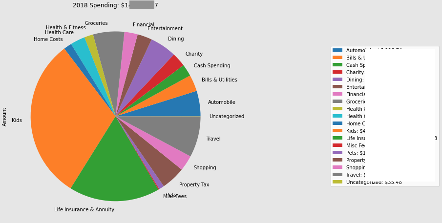

# analyze-mint-transactions

This project provides a set of scripts and visualizations that allow Mint users to analyze their spending and income.

## NEWS - March, 2023
Mint is still active but is now scheduled to shut down in March, 2024.  This release adds support for transactions imported from [Lunch Money](https://my.lunchmoney.app/overview) an awesome Mint replacement that is undergoing active development including an API to manage and programatically export transactions.   I prefer Lunch Money to Empower and reccomend it to anyone looking for a Mint replacement.  Since Mint has an API there is no need to manually export transaction for analysis with the scripts in this repo.   If the configuration variable NEW_TRANSACTION_SOURCE is set to "lunchmoney", new transactions will be fetched via API, converted to Mint format and added to the local copy of transactions for analysis. 

## NEWS - December, 2023
Intuit announced that Mint is shutting down on Jan 1, 2024.  This release adds support for transactions exported from the  [Empower Transactions Dashboard](https://home.personalcapital.com/page/login/goHome).   Transactions are converted to mint format in [process-empower-transactions.py](./process_empower_transactions.py).   This approach enables potential support for other tools as well.

This release also adds the ability to merge a subset of recently exported transactions to a longer running local list of transactions, and adds support for exluding transaction data from particular specified accounts from the analysis.

## How it works

An analysis of income and spending patterns is performed on individual transaction data exported from Intuit Mint, Empower or Lunch Money.   The location of this raw transaction data, is sepecified in the PATH_TO_YOUR_TRANSACTIONS variable in [expenses_config.py](./expenses_config.py) and is `./transactions.csv` by default.

Once an extract of transaction data is locally available, the first step is to transform this into a data set useful for spending or income analysis.
This processed data is then used to perform the following analyses:

- Visualize Annual Spending by Spending Group
  

- Predict Future Years Budget Needs by Averaging Expenses across past years
  
  
- Predict Spending Needs in Retirement
  

- Visualize Year over Year trends for each Spending Group
    
  
- Analyze year over year Spending Group by Category
    

Similar analyses are also made for income with these tools.

This project may be useful for Mint users who are comfortable exporting their transactions history to a .csv file. This project leverages both python `.py`, and `.ipython/juptyer` notebook files.   Users do not need to be familiar with python to run these scripts, but they should be comfortable working in a command line environment, editing csv files with a tool like MS Excel, and with installing the necessary programs as described in the checklist below.

## Checklist to build and start the application

Prerequisites:

1) The utilities in this package require conda python.  If this is not yet installed please, download and install it from here:  https://conda.io/miniconda.html

2) Using the git command line utility, clone [this projects repo](https://github.com/jpjpjp/analyze-mint-spending).  If you aren't familiar with cloning github repos you can download the project as a zip file by clicking on the green "Code" button above and selecting "Download ZIP".

3) Once properly cloned, or extracted, run the following command in the project directory:

    `conda env create -f environment.yml`

4) This will create the environment for the scripts to run in and download all necessary dependencies.   After this process completes run this command:

    `conda activate analyze-mint-transactions`

This will "activate" the anaconda environment that will allow python to run. This final step must be repeated whenver the user starts a new command shell session in the project directory. (For those using an autoenv type utility, there is also a .env file for automatically activating the environment whenever the directory is entered.)

## Exporting Mint Transactions
Go to your Mint `Transactions`, it should look something like this:


Next, to export your transaction history, scroll to the bottom of the tab, and click the export link, which will prompt your browser to download a file. 


Save the export to file called `transactions.csv` in this project's directory.

Mint limits the amount of transaction data that can be exported, so long time users of this tool will need to maintain a local historical copy of their exported transaction data.  Users can merge periodically exported new transactions to this data by specifying PATH_TO_NEW_TRANSACTIONS in the config file.  NEW_TRANSACTION_SOURCE can be set to "mint" to indicate its source. When configured with these parameters, the tool will automatically merge the new transactions from PATH_TO_NEW_TRANSACTIONS to PATH_TO_YOUR_TRANSACTIONS.

## Exporting Transaction Data from Empower

Given the shutdown of Mint on Jan 1, 2024, I've found Empower to be a reasonable alternative website for aggregating transaction data from multiple accounts.   Like Mint it allows you to categorize each transaction and to export transactions to a CSV file.

** Update -- I no longer recommend Empower as a Mint alternative.  Their export process does not work with split transactions, and their support team responds that they have no intention of adding this feature **

Empower's exported transaction format differs slightly from Mint's.   As a consequence, data exported from Empower must be saved to an empower specific csv file (ie: `empower-transactions.csv`) and transformed to mint format before it can be operated on.

Empower users **must** set PATH_TO_NEW_TRANSACTIONS to the name of the csv file exported from Empower, and set NEW_TRANSACTION_SOURCE to "empower".   The tools will transform this data to mint format, and add new transactions to the csv filename specified by PATH_TO_YOUR_TRANSACTIONS in [expenses_config.py](./expenses_config.py)

Over time users can choose to do small periodic exports of Empower data to be merged with their local copy of historical data in PATH_TO_YOUR_TRANSACTIONS, or they can simply export all of their transaction data from Empower, each time they run the tool.  If choosing the latter approach, delete the local copy of the PATH_TO_YOUR_TRANSACTIONS file before running the tool so that it does not interactively ask the user how to manage duplicate transactions.

## Importing Transactions from Lunch Money

I now recommend Lunch Money as a Mint replacement.  It has an active developer and community with a [Discord Server](https://discord.com/channels/842337014556262411/).  It also has an API that allows for programatic download of transactions.

To add transactions from Lunch Money to an existing set of Mint Transactions to analyze simply set the following in [expenses_config.py](./expenses_config.py)

  - PATH_TO_YOUR_TRANSACTIONS - a CSV file with a set of transactions exported from Mint.   
  - NEW_TRANSACTION_SOURCE = "lunchmoney"
  - LUNCHMONEY_API_TOKEN - API Key found here: [Developers - Lunch Money](https://my.lunchmoney.app/developers)
  - LOOKBACK_DAYS - The number of days before the most recent transaction in PATH_TO_YOUR_TRANSACTION to use as the start date for fetching transactions from Lunch Money
  - LM_FETCHED_TRANSACTIONS_CACHE - a filename to use as a cache for fetched transactions from Lunch Money.   This cache will be used if there are multiple API requests for transactions in the same date range and should be deleted if transactions are changed in the Lunch Money app.

## Preparing to extract just the Spending and Income transactions

Mint can capture both spending and income, but the total set of transactions that come from a mint export includes many things and may be categorized into more categories than allow for meaningful analysis.   Getting just the meaningful spending or income data can be a bit tricky.   Before the scripts can be run the user must set some configuration files that help separate the wheat from the chaff.

### Define Spending Groups

The Mint web interface groups categories into broader Spending Groups, for example categories such as "Tuition", "Student Loan", and "Books & Supplies" are all part of the "Education" Spending Group.   Unfortunately, Mint does not provide a way to maintain the Spending Group data as part of their export process.   Empower does not have this concept at all.

These tools can restore (or create new) Spending Group classifications to the data set. To do this, a CSV (comma separated values) file, which describes which Categories belong to which Spending Group, is taken as input.  This project includes a [mint-spending-groups-template.csv](./mint-spending-groups-template.csv) file which matches the default Mint Spending Group definitions.

The format of the file is that the Spending Groups are defined in the first row, with the categories for each group included in that column, ex:
| Home            | Education             | Entertainment          |
|-----------------|-----------------------|------------------------|
| Home Supplies   | Tuition               | Arts                   |
| Rent            | Student Loan          | Music                  |
| Mortgage        | Books & Supplies      | Movies & DVD           |
| Home Insurance  |                       | Newspapers & Magazines |

Users should copy this file to a new filed called `mint-spending-groups.csv` which can be edited to include any custom created categories or to override the Mint default Spending Group logic.  Any transactions with Categories not defined in the Spending Group configuration file will be assigned a Spending Group with the same name as the Category.

The specific name and location of this configuration file can be set using the PATH_TO_SPENDING_GROUPS configuration varaible in [expenses_config.py](.expenses_config.py)

### Exclude non-meaningful data

Mint data may include transactions that are not strictly spending or income.  For example, when credit cards are linked, payments to the credit card show as income (or a "Transaction Type" of "credit") from the credit card account but will also show up as a payment (or a "Transaction Type" of "debit") from your bank account.   We want to exclude all of this when analyzing income or spending, since each individiaul charge to the credit cards is also stored as a transaction, and this data is more meaningful.

Another problem area could be reimbursable business expenses.  These may show up in mint as both debits and credits and if we simply remove all credit transactions our spending numbers can be artificially high.   Some Mint users may also have transactions associated with a small business, such as an income property.   It may be helpful to remove these when doing a personal spending analysis. (Income Property owners may be interested in a companion project to [analyze Mint transactions associated with a property](https://github.com/jpjpjp/analyze-property))

These scripts can remove, and provide some level of analysis on, transactions that belong to Spending Groups that we want to exclude from our spending or income data sets.   For users who are interested in analyzing their spending, this project includes an [exclude-from-spending-groups-template.csv](./exclude-from-spending-groups-template.csv) file which suggests Spending Groups to remove from the spending transaction data.  The format of this file is as follows:

| Spending Group       | Hide Analysis         |
|----------------------|-----------------------|
| Credit Card Spending |                       |
| Transfer             |                       |
| Income               | True                  |

Users should copy this file to a new file called `exclude-from-spending-groups.csv` and update it based on their own data.   When the scripts are run, all transactions associated with the listed Spending Groups are removed from the data set.  Unless the "Hide Analysis" column is set to True, the script will print out some details about the credits and debits associated with all the transactions in the group.  For Spending Groups like Credit Card Spending, or Reimbursable Expenses it can be useful to see if these numbers roughly match, as this may indicate the need to re-categorize certain transactions in Mint.

The process is similar for creating a data set for an income analysis, although the scripts are smart enough to remove any Spending Group whose transactions include more debits than credits in the aggregate.  Copy the file [exclude-from-income-groups-template.csv](./exclude-from-income-groups-template.csv) to a new file called `exclude-from-income-groups.csv` and update it with Spending Groups you want to explicitly remove from the income data set.

### Extract all transactions associated with certain accounts
As I began to realize the value of periodically looking at all my transaction data in Mint to identify issues I realized that my mother could also benefit from having someone look at her data, so I added her accounts to Mint and monitor her transactions as well.   However, I don't want to include her transaction data when analyzing my family's spending patterns so I've updated to the tools to extract all transactions associated with her accounts from my local copy of my raw transaction data.   The tools also create a local copy of just her transaction data, so that I can run a seperate analysis of her spending and income if I want.

To enable this extraction simply set the following variables in [expenses_config.py](./expenses_config.py):
- THIRD_PARTY_ACCOUNTS - a python list of of account names, ie "['Granny Checking', 'Granny Visa']"
- THIRD_PARTY_PREFIX - a string to prepend to the PATH_TO_YOUR_TRANSACTIONS file that contains the transactions accociated with these accounts.

If these parameters are not set, all the exported transaction data will be maintained.

### Eliminate partial year data from fututure predictions

Predictions of future year and retirement spending are based on averages from prior years.  In order to ensure that the averages aren't skewed by partial year data, the current year's spending is excluded from the analysis.   Users will also need to set a configuration parameter indicating which years to ingore because their data is incomplete.

These configurations, and many others, are set in a [expenses-config.py](./expenses_config.py) file.   For the most part the default configurations will work as is, but the `IGNORE_YEARS_BEFORE` parameter should be set to the latest year of incomplete data in your mint transactions export.  Edit this section of the file:

```python
# Set this to skip data from old or imcomplete years
IGNORE_YEARS_BEFORE = 2014

# Get the current year.  We'll exclude expenses in the current year from the Averages
# Simply set current year to a future year if you prefer to include this year in the average
import datetime
currentDateTime = datetime.datetime.now()
date = currentDateTime.date()
CURRENT_YEAR = int(date.strftime("%Y"))
# CURRENT_YEAR = 2999
```

## Running the tools from the command line

A convenience shell script [run-all.sh](./run-all.sh) will merge and transform recently exported transaction data, extract all the spending and income data, and open new browser pages with analyses of the income and spending found in the mint data.    

Inside this shell script, the following python scripts are being run:

- [extract_spending_and_income.py](./extract_spending_and_income.py) - this script checks if PATH_TO_NEW_TRANSACTIONS is set.  If it is, and that file is newer than the PATH_TO_YOUR_TRANSACTIONS, it aggregates the new transaction data with the locally stored historical copy. This step may require interaction from the user if possible duplicate transactions are detected.  Once all transactions are aggregated it reads the transaction data, adds a new "Spending Group" column, removes transactions as specified by the exclusion configuration files, and extracts the income and spending related transactions into new csv files. It also creates an income_by_group and spending_by_group summary csv file.

- [visualize_income_by_year.py](./visualize_income_by_year.py) - this script generates an html page with pie charts for each full year of income data indentifying the sources of income

- [show_income_group_details.py](./show_income_group_details.py) - this script generates tables with annual income by category for each Spending Group that generated income

- [visualize_spending_by_year.py](./visualize_spending_by_year.py) - this script generates an html page with pie charts for each full year of spending data indentifying spending by spending group

- [predict_future_spending.py](./predict_future_spending.py) - this script generates an html page with the average spending per year based on past years, and an additional predicted retirement spending which is generated by removing the Spending Groups specified in the `EXCLUDE_FROM_RETIREMENT` variable set in [expenses-config.py](./expenses_config.py).   This output is skipped in cases where there is not at least one complete year of historical transaction data.

- [show_spending_group_details.py](./show_spending_group_details.py) - this script generates tables with annual spending by category for each Spending Group that generated income.   This data is color coded to show where spending is 10% or 25% higher or lower than the previous year's spending in that category (on the first chart), or higher or lower than the average (on the second chart).

- [save_todays_transactions.py](./save_todays_transactions.py) - this script checks if newly exported transactions were aggregated today.  When this happens the newly aggregated transaction data is stored in a temporary file that includes today's date.   When this file is detected the user is prompted to see if they want to move this temporary file to the file specified by the PATH_TO_YOUR_TRANSACTIONS parameter.

The extract_spending_and_income scripts open windows with a text file of output with quite a bit of information about how each Spending Group was processed.  It is worth reading through this output carefully, as it can help you find problems with the data.   Typically you'll need a few runs, with trips back to Mint to clean things up before you have a good output.   The csv files generated by these scripts (defined in the OUTPUT section of [expenses-config.py](./expenses_config.py)  are used as input to the other scripts which perform visualizations on that data.

Some users may wish to only run a subset of these scripts, for example to focus primarily on spending rather than income, or to generate just the extracted income and spending transactions to perform their own analysis.

## Running the tools as jupyter notebooks

This project also provides jupyter notebooks for users who are familiar with these and like the ability to interactively tweak the scripts.  Start Jupyter from the working directory (the project directory with these scripts) by typing:

  `jupyter notebook` 

This will open up a page in your default browser.  From there click on either `analyze_spending_from_mint.ipynb` or `analyze_income_from_mint` to open the notebook up in a new tab.  It should look something like:


The first cell defines the configuration variables.   For the most part the defaults should be fine, but you may wish to change the `IGNORE_YEARS_BEFORE` variable to match the most recent year in your mint transaction data that is incomplete.

Once this file is open you can begin running the spending analysis, cell by cell, or by selecting "Run All" from the Cell menu:


Alternately, for VSCode users, there are now Jupyter plugins to run the notebooks directly within the editor, so feel free to use this approach if you prefer.

The cells essentially mimic the steps run in the various income and spending related python scripts but provide a single place to review the results inline.   I find the jupyter notebooks are a handy way to understand what the scripts are doing, but running the scripts from the command line and viewing the generated HTML pages are more useful for really understanding what the data is telling me.

### Library methods

Both the python scripts and the jupyter notebooks rely on some functionality that is exposed in several local python modules:

- [add_new_transactions.py](./add_new_transactions.py) - the file includes methods for merging new transaction data with a locally stored copy of historical transaction data.  It generates output showing which transactions were added and detects possible duplicate transactions, querying the user on how to handle them.
- [extract_spending_data_methods.py](./extract_spending_data_methods.py) - this file includes methods to read and generate the various input and output csv files.
- [process_empower_transactions.py](./process_empower_transactions.py) - this file includes the methods for converting transactions in empower format to the underlying mint format used by these tools.
- [visualization_methods.py](./visualization_methods.py) - this file includes the methods used to generate the pie charts and tables.

If you are playing around in jupyter, feel free to pull the relevant methods out of the python file and paste them into cells in the jupyter notebook so you can tweak them as you like.


### Other tools
- [get-category-transaction.py](./get_category_transactions.py) is a python command line tool that will prompt you for a Spending Group and year range, and generate a CSV file that will show the year over year spending for each category in that group as well as the entire set of transactions for the for each year that belong to the Spending Group.  I've found this to be helpful to understanding changes in my family's spending habits and also for identifying mis-categorized transactions or categories that may belong in another spending group.   I initially created this as a [jupyter notebook](./get_category_transactions.ipynb), for those who prefer working in that model, but I found it easier to look at the data in a seperate csv and found the cmd line interface ultimately more convenient.

- [find-duplicate-transactions.ipynb](./find_duplicate_transactions.ipynb) is a notebook that may be handy if you suspect that duplicates transactions may have crept into your transaction data.  There was a brief period where mint exports included pending transactions that later changed descriptions when they settled.  This no longer seems to be the case, but its handy to have a tool to look for duplicates every once in a while.

Your mileage may vary as you play with these tools but feel free to open an issue on github if you have any questions getting them to work for you.

Have fun!!

## Still on the TO DO list

[ ] Be smarter about the years of data available.  It would be great not to have to set the IGNORE_YEARS_BEFORE configuration.

[ ] Improve the visualizations.  This is stolen from a small project I did in 2017 to learn matplotlib.  I'm sure the state of the art is much better these days (and probably then too if I'm being honest...)
